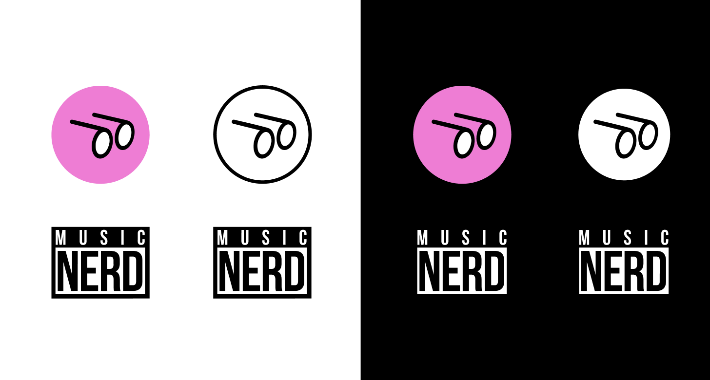

# Music Nerd Brand

Versioned home for the current delivered Music Nerd raster logo exports and practical guidance for using them across xDJs projects.



## Start here

- Choose a logo export from [`assets/logos`](assets/logos) and check its documented constraints below.
- Read the full [usage guidance](docs/usage.md) before placing or modifying an asset.
- Check the [source manifest](docs/source-manifest.md) for delivery names, dimensions, transparency, and checksums.

Files in `assets/reference` document the design handoff. They are reference material, not production assets.

## Asset picker

| Need | Use | Notes |
|---|---|---|
| Pink circular specs badge | [`specs-pink.png`](assets/logos/specs-pink.png) | Transparent outside the circle; demonstrated on light and dark backgrounds. |
| Monochrome circular badge | [`specs-monochrome.png`](assets/logos/specs-monochrome.png) | White circle with black specs; transparent outside the circle. |
| Social avatar | [`specs-social.png`](assets/logos/specs-social.png) | Opaque, full-bleed pink square prepared for social cropping. |
| Custom bleed composition | [`specs-isolated.png`](assets/logos/specs-isolated.png) | Tom limited this treatment to custom work, ideally on Music Nerd pink. The artwork appears clipped at three canvas edges, so request a corrected export for general placement. |
| Supplied wordmark lockup | [`music-nerd-wordmark-black-field.png`](assets/logos/music-nerd-wordmark-black-field.png) | The black field is part of the export; it is not a transparent wordmark. |

## Confirmed brand direction

The handoff from Tom provides three explicit directions:

1. Music Nerd pink is `#FF75D8` (sRGB `255, 117, 216`).
2. Use the isolated specs only for custom work, ideally on that pink.
3. In composed work such as web pages and presentations, prefer specs at top-left and the wordmark at bottom-right when practical. This composition is ideal, not mandatory.

The handoff does not define a primary logo, numerical clear space, minimum sizes, print colors, or platform-specific icon rules. The [usage guide](docs/usage.md) labels practical stewardship recommendations separately from Tom's confirmed direction.

## Using assets in a project

1. Copy the appropriate master from `assets/logos` into the consuming project's normal asset pipeline.
2. Generate project-specific sizes from that copy; keep the master in this repository unchanged.
3. Preserve the aspect ratio, supplied colors, transparency, and intentional crop.
4. Pin important integrations to a tagged release or commit instead of hotlinking GitHub-hosted image URLs.
5. Check the result at its real rendered size and on its real background.

Only PNG masters were delivered. Request official vector artwork before print, large-format, or other resolution-independent use. Do not auto-trace a PNG and present it as an official master.

## Repository map

```text
assets/
  logos/       Delivered logo exports and their documented constraints
  reference/   Handoff screenshots and treatment references
docs/
  source-manifest.md
  usage.md
scripts/
  validate-assets.mjs
```

Run `npm test` with Node 20 or newer to verify that every PNG is listed, unmodified, and has the expected dimensions.

## Updating the brand package

Follow [CONTRIBUTING.md](CONTRIBUTING.md). Designer-approved replacements should include provenance, updated checksums, and matching documentation in the same pull request.

## Rights

This repository intentionally has no open-source license. See [TRADEMARKS.md](TRADEMARKS.md) before redistribution or third-party use.
